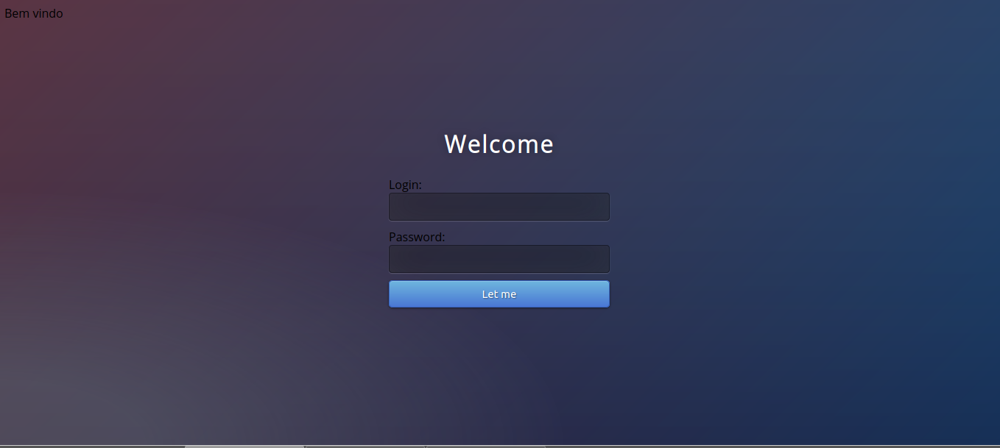
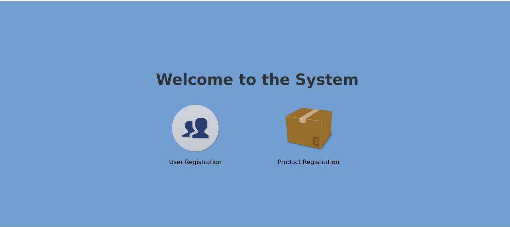
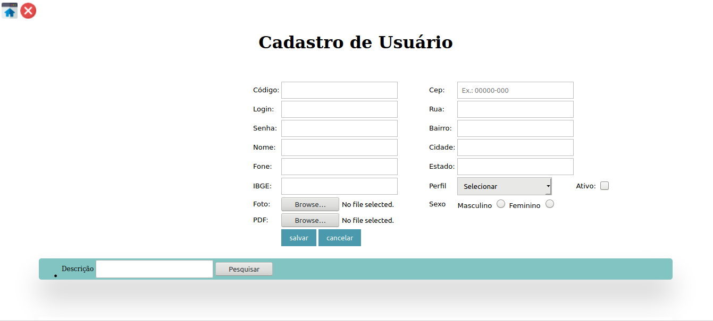
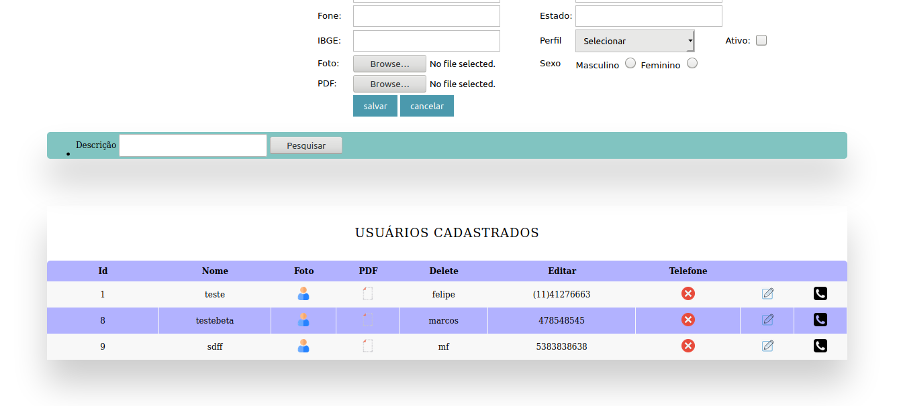
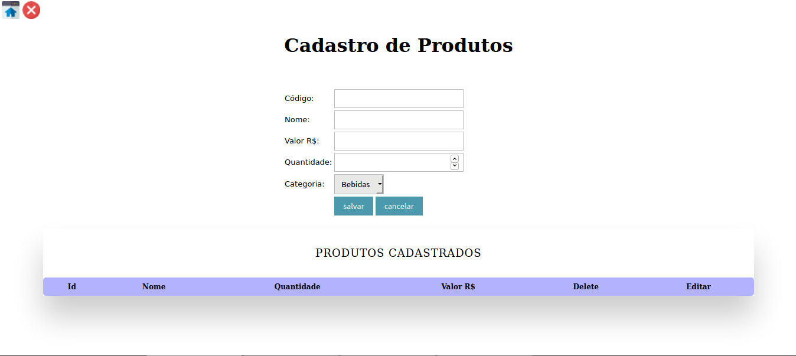

# Curso_JSP
## Projeto didatico utilizando JSP + Servlet + JDBC com o banco de dados PostgreSQL 

### Tela de Login

### Tela do Systema

### Tela de Cadastro de Usuarios

### Tela de Cadastro de Produtos

